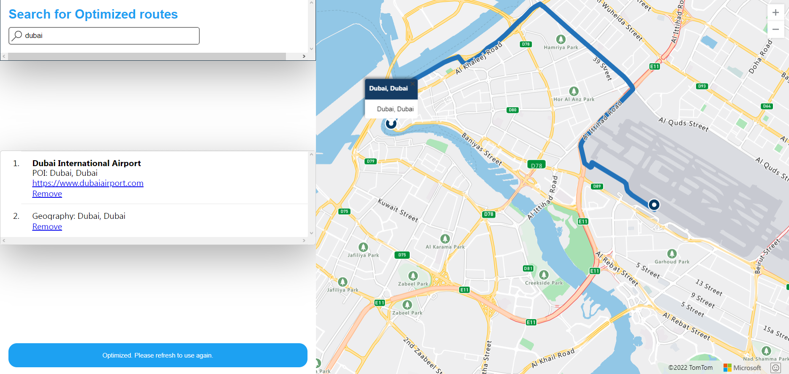

## Multi-Point Tour Routing System

## What is it for ?

It's hard for tourism agencies to decide best route to visit all the specified tour locations in optimistic way. They want to visit each location and return to home location in most cost-saving way.

It's similar to travelling salesman problem where they have to visit each location atleast once and return to home location, in optimistic way. This will allow them to reduce different costs such as fuel costs, save time etc. My project will use advanced algorithms provided by azure to find the optimistic route for visiting each locations. It will use azure maps to allow user to choose different locations and then find the optimized route. It will also have option to save the route.

## Tools/Technology used:

1) Azure Maps
2) Static Web Apps

## The Project in action (link) :

https://kind-rock-0dd4bc810.1.azurestaticapps.net

## Demo:

https://user-images.githubusercontent.com/62178897/160606901-230c552f-396c-4d6a-8ca8-3a7def1927b7.mp4

